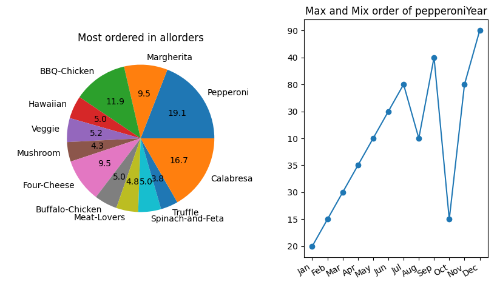

# DataPlotCSV
A easy and best form to see your orders to month and years in a simple chart figure <br>
Make in python using the framework pyplot, this program was made for facility your produtivity and make best decisions in your enterprise

# Description
Thats project get csv files and "transform" the information in a 2 types of chart, circle chart, and bar chart <br>
Is recomended use the circle chart for the products sales in years example: 

| Most Order Items: | --- | Min and Max order of apple in months: |
| :---:  | :---: | :---: |

| Item   | OrderInYear |  --- | Month | OrderInMonth |
| :---:  | :---: | --- | :---: | :---: |
| Banana | 9  | --- | Jan | 9 |
| Tomato | 5  | --- | Fev | 5 |
| Apple  | 10 | --- | Mar | 10|
| Pear   | 3  | --- | Apr | 3 |

---
<div align="center">
<h3><strog> EXAMPLE OF INFORMATIONS WITH PYPLOT </strog></h3>
<a href="#"></img></a>
</div>

---
# How to install
- Install [python](https://www.python.org/)
- ```pip install matplotlib```
# How to use

- You need two archives .csv, first saying all orders in a year or another thing, and second saying the especific item sale in a year
- Start the code (```python csvChart.py```)
- Insert the file path of first csv file and after the second csv file
- Tada! The first file will turn a circle chart and second a bar chart

Another way to start code without after insert the file path is insert in command
example: (```python csvChart.py allorders pepperoniInYear```)
# Youtube Video
Click [here](https://youtu.be/PbN-GhUjSq4)
